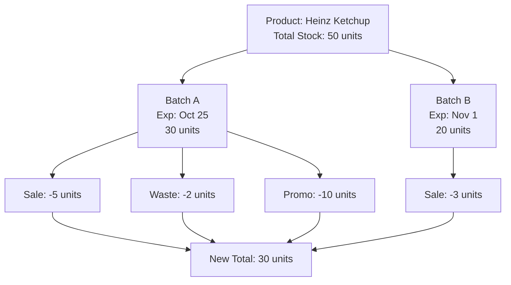

Great question! The relationship between **batches** and **product stock** is fundamental. Think of it as the difference between seeing your bank account total versus seeing individual transactions.

## The Core Relationship

**Product Stock = The SUM of ALL Batches for that Product**

Here's the breakdown:

### 1. Stock Calculation

- **Without Batches:** Your POS shows: "Heinz Ketchup: 50 units"
- **With Batches:** Your POS shows: "Heinz Ketchup: 50 units" **but it's calculated as:**
  - Batch A (Exp: Oct 25): 30 units
  - Batch B (Exp: Nov 1): 20 units
  - **Total Stock = 30 + 20 = 50 units**

### 2. Stock Movement Impact

When you sell items, batches determine **which specific stock** gets reduced:

**Sale of 1x Heinz Ketchup:**

- **System Behavior:** Deducts from the **oldest batch first** (Batch A)
- **Result:**
  - Batch A: 30 → 29 units
  - Batch B: 20 → 20 units
  - **Total Stock:** 49 units (29 + 20)

### 3. Real-world Examples of the Relationship

| Scenario            | What You See (Product Stock)        | What's Happening (Batch Level)                                             |
| ------------------- | ----------------------------------- | -------------------------------------------------------------------------- |
| **Receiving Goods** | "Milk stock increased by 100 units" | "Created Batch A: 60 units (Oct 25) Created Batch B: 40 units (Oct 28)" |
| **Daily Sales**     | "Sold 25 milks today"               | "Batch A: -20 units Batch B: -5 units"                                  |
| **Stock Check**     | "We have 75 milks in stock"         | "Batch A: 40 units (expiring soon!) Batch B: 35 units"                  |
| **Expired Goods**   | "We discarded 10 expired milks"     | "Batch A: -10 units (expired) Batch B: unchanged"                       |

### 4. Why This Relationship Matters for Business Decisions

**Without Batch Awareness:**

- "We have 75 milks, we're fine!"
- **Reality:** 40 of them expire tomorrow!

**With Batch Awareness:**

- "We have 75 milks, but 40 expire tomorrow—let's run a promotion NOW!"
- This prevents massive waste and loss.

### 5. Practical Implications for Your POS

### 6. Stock Alerts Based on Batches

- **Low Stock Alert:** "Heinz Ketchup below 25 units"
- **Expiry Stock Alert:** "Batch A of Heinz Ketchup (15 units) expires in 3 days"
- **Critical Alert:** "35% of your ketchup stock expires this week!"

## Key Takeaway

**Batches give CONTEXT to your stock numbers.** They answer the critical question: "Yes, I have X units, but **how much of it is actually sellable** and for **how long**?"

This relationship transforms your POS from a simple counting machine into an intelligent business management system that helps you:

- Reduce waste
- Optimize promotions
- Make smarter purchasing decisions
- Maintain better cash flow

The stock number tells you **quantity**; the batches tell you **quality and urgency**. You need both to run an efficient business.
