# Clock-In/Clock-Out System - Complete Guide

## Table of Contents

1. [Overview](#overview)
2. [Core Concepts](#core-concepts)
3. [Features](#features)
4. [Database Schema](#database-schema)
5. [API Reference](#api-reference)
6. [Business Rules](#business-rules)
7. [Security & Compliance](#security--compliance)
8. [UI/UX Guidelines](#uiux-guidelines)
9. [Integration Examples](#integration-examples)
10. [Common Patterns](#common-patterns)
11. [Configuration](#configuration)
12. [Testing](#testing)
13. [Troubleshooting](#troubleshooting)
14. [Best Practices](#best-practices)

---

## Overview

This document describes the comprehensive clock-in/clock-out system integrated with the user authentication system for the AuraSwift POS. The system automatically tracks employee time, manages shifts, handles breaks, and provides detailed reporting capabilities while maintaining a clear separation between authentication (login/logout) and time tracking (clock-in/clock-out).

### Key Capabilities

- Automatic or manual time tracking
- Break management with paid/unpaid tracking
- Time correction workflows with approval
- Fraud detection and validation
- Comprehensive reporting and analytics
- Complete audit trail for compliance
- Real-time dashboard for managers

---

## Core Concepts

### 🔐 Login / Logout – Authentication

**Purpose:** Identifies who is accessing the POS system and determines what they're allowed to do.

**Where it's used:**

- When an employee needs to **use the system** to perform tasks
- **All roles** (Admin, Manager, Cashier) must log in using **username + PIN** for security and role-based permissions

**Key Points:**

- A **Login** button appears when the terminal is locked or idle
- A **Logout** button allows the user to exit or switch users without ending their shift
- May include an auto-logout timeout for security
- **Login is about system access, not time tracking**

### ⏱️ Clock In / Clock Out – Time Tracking

**Purpose:** Tracks the employee's work hours for payroll and scheduling.

**Where it's used:**

- Only applies to **employees with tracked shifts** (typically Managers and Cashiers)
- Admins often don't need to clock in unless they're also working hourly

**Key Points:**

- Clocking in should be done **before logging in**, or immediately after logging in if tied to authentication
- It's **separate from logout** – an employee might log out (lock the screen) but stay clocked in
- **Clock-in/out is about time tracking, not system access**

### 👨‍💼 Example Workflows

#### Scenario A: Cashier Using Automatic Clock-In (Most Common)

1. Cashier arrives at work
2. Clicks **Login** button → enters username + PIN
3. **System automatically clocks them in** (no extra button needed)
4. Cashier performs transactions throughout the day
5. Clicks **Logout** at end of shift
6. **System automatically clocks them out**

**Result:** Simple one-click experience, time tracked automatically

---

#### Scenario B: Employee Using Manual Clock-In (No POS Access Needed)

1. Warehouse worker arrives (doesn't need POS access)
2. Clicks **Clock In** button on login screen → enters username + PIN
3. **System clocks them in** (but they're NOT logged into POS)
4. Worker goes to warehouse to stock shelves (no terminal needed)
5. Returns at end of shift
6. Clicks **Clock Out** button → enters username + PIN
7. **System clocks them out** (they never logged in)

**Result:** Time tracked without needing POS system access

---

#### Scenario C: Cashier Clocking In Early (Manual THEN Automatic)

1. Cashier arrives 10 minutes early
2. Clicks **Clock In** button on login screen → clocked in
3. Goes to break room (not ready to use POS yet)
4. Returns to terminal
5. Clicks **Login** → logs into POS
6. **System detects already clocked in**, doesn't create duplicate
7. Works their shift
8. Clicks **Logout** → automatically clocked out

**Result:** Early clock-in preserved, no duplicate clock events

---

#### Scenario D: Manager Force Clock-Out (Manual Override)

1. Cashier forgot to clock out yesterday
2. Manager logs in
3. Manager goes to Time Management → **Force Clock Out**
4. Selects the cashier and enters clock-out time
5. System creates manual clock-out event with manager override

**Result:** Manager can correct forgotten clock-outs

### Role-Based Summary

| Feature       | Purpose           | Who Uses It           | When to Use                              |
| ------------- | ----------------- | --------------------- | ---------------------------------------- |
| **Clock In**  | Start shift time  | Cashier/Manager       | At the beginning of a work shift         |
| **Clock Out** | End shift time    | Cashier/Manager       | At the end of a work shift               |
| **Login**     | Access POS system | Admin/Manager/Cashier | Whenever performing a task on the system |
| **Logout**    | End session       | Admin/Manager/Cashier | When switching users or walking away     |

### Automatic Clock-In/Out Behavior by Role

| Role        | Auto Clock-In on Login? | Auto Clock-Out on Logout? | Why?                                   |
| ----------- | ----------------------- | ------------------------- | -------------------------------------- |
| **Cashier** | ✅ Yes                  | ✅ Yes                    | Hourly employee - time must be tracked |
| **Manager** | ✅ Yes                  | ✅ Yes                    | Hourly employee - time must be tracked |
| **Admin**   | ❌ No                   | ❌ No                     | Salaried employee - no time tracking   |

**Note:** Admins can still manually clock in/out if they need to track time for a specific shift.

---

### 🔄 Automatic vs 🖱️ Manual: Feature Comparison

| Aspect                      | Automatic Clock-In/Out            | Manual Clock-In/Out                 |
| --------------------------- | --------------------------------- | ----------------------------------- |
| **Trigger**                 | Login/Logout buttons              | Dedicated Clock In/Out buttons      |
| **Requires Login?**         | Yes (must authenticate)           | No (can clock without logging in)   |
| **Requires System Access?** | Yes (logs into POS)               | No (just time tracking)             |
| **Who Uses?**               | Cashiers/Managers primarily       | Anyone (especially non-POS workers) |
| **When?**                   | Every login/logout                | As needed, independent of login     |
| **Manager Override?**       | No                                | Yes (force clock-out)               |
| **Use Without POS?**        | No (must use terminal)            | Yes (track time anywhere)           |
| **Duplicate Prevention?**   | ✅ System checks for active shift | ✅ System checks for active shift   |

**Key Insight:** Both features use the **same underlying time tracking system** - they just provide different entry points:

- **Automatic** = Convenience for POS users (cashiers/managers)
- **Manual** = Flexibility for all users and special cases

### Understanding "Logged Out but Still Clocked In"

**Clock In/Out** and **Login/Logout** are separate actions:

- **Clock In** = Start tracking work time
- **Clock Out** = Stop tracking work time
- **Login** = Access POS features
- **Logout** = Exit POS session (security or switching users)

**Example Scenario:**

- A Cashier clocks in at 9:00 AM
- They ring up sales until 12:00 PM
- They **log out** to let someone else use the register (but forget to clock out)
- They are **logged out**, but still **clocked in** (the system thinks they're still working)

**Why Allow Logout While Clocked In?**

- Employees may need to step away temporarily (breaks, change register, etc.)
- Time tracking needs to continue during breaks unless "break" is logged separately
- Managers' work isn't always tied to terminal usage

### State Comparison Table

| Action             | Logged In | Clocked In | Timer On?          |
| ------------------ | --------- | ---------- | ------------------ |
| Cashier clocks in  | ❌        | ✔️         | ✔️                 |
| Cashier logs in    | ✔️        | ✔️         | ✔️                 |
| Cashier logs out   | ❌        | ✔️         | ✔️ (still working) |
| Cashier clocks out | ❌        | ❌         | ❌                 |

---

## Features

### 1. Automatic Clock-In/Clock-Out on Login/Logout

**Role-Based Automatic Behavior:**

- **✅ Cashiers & Managers:**

  - Automatically clocked in when they click the **Login** button
  - Automatically clocked out when they click the **Logout** button
  - This ensures accurate time tracking for hourly employees

- **❌ Admins:**

  - **NOT** automatically clocked in when they click the **Login** button
  - **NOT** automatically clocked out when they click the **Logout** button
  - Admins are typically salaried employees who don't require hourly time tracking
  - Admins can still manually clock in/out if needed (e.g., if they're working an hourly shift)

- **Flexibility:**
  - Auto clock-in/out can be disabled per login/logout if needed by passing `autoClockIn: false` or `autoClockOut: false`

### 2. Manual Time Tracking

Manual clock-in/out works **alongside** automatic clock-in/out to provide flexibility:

- Users can manually clock in/out **independent of login/logout** actions
- Provides a **standalone Clock In/Clock Out button** on the login screen
- **Does not require authentication** - useful for employees who need to track time without using the POS
- Managers can **force clock-out** users who forgot to clock out
- Allows **pre-clocking** before system access is needed

**Why Both Automatic AND Manual?**

Both features coexist to handle different scenarios:

| Scenario                                           | Which Feature? | Example                                                |
| -------------------------------------------------- | -------------- | ------------------------------------------------------ |
| Cashier arrives and starts working                 | Automatic      | Clicks "Login" → automatically clocked in              |
| Employee needs to track time but won't use POS yet | Manual         | Clicks "Clock In" on login screen without logging in   |
| Manager needs to clock out someone who forgot      | Manual         | Uses force clock-out feature                           |
| Cashier taking a break but staying logged in       | Neither        | Uses Break Management feature                          |
| Admin needs to track time for a special shift      | Manual         | Manually clocks in (auto is disabled for admins)       |
| Disable auto clock-in for a specific login         | Manual         | Pass `autoClockIn: false` then manually clock in later |

### 3. Break Management

- Start and end breaks during shifts
- Track break types (meal, rest, other)
- Mark breaks as paid or unpaid
- Prevents multiple concurrent breaks
- Break time is excluded from working hours calculation

### 4. Time Corrections

- Users can request time corrections
- Manager/admin approval required for corrections
- Tracks original and corrected times
- Full audit trail of all corrections

### 5. Fraud Detection & Validation

- Detects multiple clock-ins without clock-out
- Warns about rapid successive clock events (buddy punching)
- Flags unusual clock times (late night/early morning)
- Validates all clock events before creation

### 6. Comprehensive Reporting

- Attendance reports by user or business
- Late clock-ins tracking
- Missed clock-outs detection
- Overtime calculations
- Break compliance reports
- Payroll summaries
- Shift pattern analysis
- Real-time dashboard

### 7. Audit Logging

- Every clock event is logged
- Session creation/termination tracked
- Time corrections audited
- Manager overrides recorded
- Complete compliance trail

---

## Database Schema

### High-Level Architecture

The system uses a **unified `shifts` table** that handles both time tracking and POS operations:

- **Time Tracking** → `clockEvents` (clock in/out events) + `shifts` (references clock events via `clock_in_id` and `clock_out_id`)
- **Break Management** → `breaks` (linked to shifts), `timeCorrections` (for adjustments)
- **Cash Management** → `cashDrawerCounts` (mid-shift and end-shift counts)
- **Reporting** → `attendanceReports`, `shiftReports`, `shiftValidations`, `shiftValidationIssues`

**Key Design: The `shifts` table serves dual purposes:**

1. **Time tracking**: Links to `clockEvents` for actual clock in/out times, calculates hours worked (`total_hours`, `regular_hours`, `overtime_hours`)
2. **POS operations**: Tracks sales and cash drawer (via `starting_cash`, `total_sales`, `total_transactions`, etc.)

This unified approach allows:

- A single shift record that tracks both time AND sales
- Flexible shifts: POS shifts have `starting_cash`, non-POS shifts (warehouse workers) are time-only
- Clock events as the source of truth for timing (shifts reference them via foreign keys)

### Tables Overview

#### 1. clock_events

Individual clock-in/out events (source of truth for timing)

```typescript
{
  id: string;
  user_id: string; // FK to users
  business_id: string; // FK to businesses
  terminal_id: string; // FK to terminals - REQUIRED
  location_id?: string;

  // Event details
  type: "in" | "out";
  timestamp: number; // timestamp_ms - actual clock in/out time

  // How the clock event was created
  method: "login" | "manual" | "auto" | "manager";

  // Event status
  status: "pending" | "confirmed" | "disputed";

  // Audit trail
  geolocation?: string;
  ip_address?: string;
  notes?: string;

  createdAt: number;
  updatedAt?: number;
}
```

**Purpose:** Records every clock-in/out action with full audit details. This is the source of truth for timing.

**Key Points:**

- Links to user, business, and terminal (terminal is required)
- Timestamp stored as milliseconds since epoch
- Method indicates how event was created (login, manual, auto, manager override)
- Status tracks confirmation and disputes
- Full audit trail with geolocation and IP address
- Supports multiple clock methods for flexibility

#### 2. shifts

Unified work shifts with time tracking AND POS operations

```typescript
{
  id: string;
  user_id: string;
  business_id: string;
  schedule_id?: string;

  // Time tracking (SOURCE OF TRUTH)
  clock_in_id: string;   // FK to clock_events - REQUIRED
  clock_out_id?: string; // FK to clock_events - set when shift ends

  // Shift status
  status: "active" | "ended" | "pending_review";

  // POS-specific (nullable for non-POS shifts)
  terminal_id?: string;
  starting_cash?: number;

  // Sales totals (for POS shifts)
  total_sales: number;
  total_transactions: number;
  total_refunds: number;
  total_voids: number;

  // Time calculations (computed from clock events and breaks)
  total_hours?: number;
  regular_hours?: number;
  overtime_hours?: number;
  break_duration_seconds: number;

  notes?: string;
}
```

**Purpose:** Unified table that represents both time tracking AND POS shift data.

**Key Points:**

- **Dual purpose**: Tracks time (via clock events) and POS operations (sales, cash drawer)
- **Clock events as source of truth**: `clock_in_id` and `clock_out_id` reference `clock_events` table
- **Flexible**: POS shifts have `starting_cash` and sales data; non-POS shifts are time-only
- Calculates regular and overtime hours from clock event timestamps
- Tracks break duration (sum from `breaks` table)
- Can link to scheduled shifts via `schedule_id`

#### 3. breaks

Break periods during shifts

```typescript
{
  id: string;
  shift_id: string;  // FK to shifts
  user_id: string;
  business_id: string;

  // Break type and timing
  type: "meal" | "rest" | "other";
  start_time: number; // timestamp_ms
  end_time?: number; // timestamp_ms
  duration_seconds?: number; // Calculated when completed
  is_paid: boolean;

  // Status
  status: "scheduled" | "active" | "completed" | "cancelled" | "missed";

  // Compliance tracking
  is_required?: boolean;
  required_reason?: string; // e.g., "Labor law: 30min after 6 hours"
  minimum_duration_seconds?: number;

  // Scheduled vs actual
  scheduled_start?: number;
  scheduled_end?: number;

  // Violation tracking
  is_missed?: boolean;
  is_short?: boolean; // Didn't meet minimum duration

  notes?: string;
}
```

**Purpose:** Tracks breaks taken during shifts with compliance monitoring.

**Key Points:**

- Links to shifts table (not a separate time_shifts table)
- Start and end times as timestamps
- Break type (meal, rest, other) and paid status
- Duration calculated in seconds when break ends
- Status includes scheduled, active, completed, cancelled, missed
- Compliance tracking: required breaks, minimum duration, violations
- Prevents multiple concurrent breaks

#### 4. time_corrections

Manual time adjustments with approval workflow

```typescript
{
  id: string;
  clock_event_id?: string; // FK to clock_events
  shift_id?: string; // FK to shifts
  user_id: string;
  business_id: string;

  // Correction details
  correction_type: "clock_time" | "break_time" | "manual_entry";
  original_time?: number; // timestamp_ms
  corrected_time: number; // timestamp_ms
  time_difference_seconds: number;

  // Approval workflow
  reason: string;
  requested_by: string; // FK to users
  approved_by?: string; // FK to users
  status: "pending" | "approved" | "rejected";

  // Timestamps
  createdAt: number;
  updatedAt?: number;
}
```

**Purpose:** Handles time correction workflow with manager approval.

**Key Points:**

- Links to either a `clock_event_id` OR `shift_id` (one must be set)
- Original and corrected times as timestamps (milliseconds)
- Time difference calculated in seconds
- Approval workflow: pending → approved/rejected
- Reason required for all corrections
- Full audit trail with requester and approver

#### 5. audit_logs

Complete audit trail for compliance

```typescript
{
  id: string;
  user_id?: string; // FK to users
  action: string;
  resource: string;
  resource_id: string;
  entity_type?: string;
  entity_id?: string;
  details?: string; // JSON string
  ip_address?: string;
  terminal_id?: string; // FK to terminals
  timestamp: number; // timestamp_ms
  createdAt: number;
  updatedAt?: number;
}
```

**Purpose:** Records all time tracking actions for compliance and auditing.

**Key Points:**

- Tracks all user actions (clock in/out, breaks, corrections)
- Records entity changes with before/after states
- Manager overrides and approvals logged
- IP address and terminal for fraud detection
- Complete audit trail for legal compliance

### Database Managers

#### TimeTrackingManager (db.timeTracking)

- `createClockEvent()` - Create clock-in/out event
- `getActiveShift()` - Get user's active shift
- `createShift()` - Start new shift
- `completeShift()` - End shift
- `startBreak()` - Begin break
- `endBreak()` - Finish break
- `requestTimeCorrection()` - Request time change
- `processTimeCorrection()` - Approve/reject correction
- `validateClockEvent()` - Check for fraud/issues
- `forceClockOut()` - Manager override

#### AuditManager (db.audit)

- `logClockEvent()` - Log clock action
- `logShiftAction()` - Log shift changes
- `logBreakAction()` - Log break events
- `logTimeCorrectionAction()` - Log corrections
- `logSessionAction()` - Log login/logout
- `getAuditLogsByUser()` - Get user audit trail
- `getSuspiciousActivities()` - Get fraud alerts

#### TimeTrackingReportManager (db.timeTrackingReports)

- `generateUserAttendanceReport()` - User stats
- `generateBusinessAttendanceReport()` - All users
- `getLateClockIns()` - Tardiness report
- `getMissedClockOuts()` - Forgotten clock-outs
- `getOvertimeReport()` - Overtime summary
- `getBreakComplianceReport()` - Break violations
- `getPayrollSummary()` - Hours & pay calculations
- `getShiftPatternsAnalysis()` - Work patterns
- `getRealTimeDashboard()` - Current status

---

## API Reference

### Quick Start

#### Auto Clock-In on Login (Default Behavior)

```typescript
// ✅ Cashiers and managers automatically clock in when logging in
const result = await authAPI.login({
  email: "cashier@store.com",
  password: "password",
  terminalId: "POS-001",
});

// result includes: user, token, clockEvent, shift

// ❌ Admins do NOT automatically clock in when logging in
const adminResult = await authAPI.login({
  email: "admin@store.com",
  password: "password",
  terminalId: "POS-001",
});

// adminResult includes: user, token
// Note: No clockEvent or shift for admins (unless manually clocked in)
```

#### Manual Clock-In/Out

**Use Cases for Manual Clock-In/Out:**

- Employee needs to track time without logging into the POS
- Manager needs to clock out someone who forgot
- Admin wants to track time (since auto clock-in is disabled)
- Disable automatic behavior and use manual control instead
- Clock in early before needing POS access

```typescript
// Manual clock in (without logging in)
await authAPI.clockIn({
  userId: "user-id",
  terminalId: "POS-001",
});

// Manual clock out (without logging out)
await authAPI.clockOut({
  userId: "user-id",
  terminalId: "POS-001",
});
```

**How Manual Works With Automatic:**

```typescript
// Example 1: Cashier uses Login (automatic clock-in)
const result = await authAPI.login({
  email: "cashier@store.com",
  password: "password",
  terminalId: "POS-001",
  autoClockIn: true, // Default for cashiers
});
// Result: Logged in + Clocked in (automatic)

// Example 2: Employee uses manual clock-in (no login)
await authAPI.clockIn({
  userId: "employee-id",
  terminalId: "POS-001",
});
// Result: Clocked in only (not logged in)
// Employee can now go work elsewhere without POS access

// Example 3: Admin disables auto and uses manual
const adminResult = await authAPI.login({
  email: "admin@store.com",
  password: "password",
  terminalId: "POS-001",
  autoClockIn: false, // Default for admins
});
// Result: Logged in only (not clocked in)

// Admin manually clocks in if needed
await authAPI.clockIn({
  userId: adminResult.user.id,
  terminalId: "POS-001",
});
// Result: Now logged in + clocked in

// Example 4: System prevents duplicate clock-ins
// Cashier manually clocks in at 8:50 AM
await authAPI.clockIn({
  userId: "cashier-id",
  terminalId: "POS-001",
});

// Cashier logs in at 9:00 AM (automatic clock-in would trigger)
const result = await authAPI.login({
  email: "cashier@store.com",
  password: "password",
  terminalId: "POS-001",
  autoClockIn: true,
});
// Result: Logged in successfully
// Clock-in NOT duplicated (system detects active shift from 8:50 AM)
```

### Authentication with Time Tracking

#### Login with Auto Clock-In

```typescript
// ✅ For Cashiers & Managers (auto clock-in enabled by default)
await authAPI.login({
  email: "cashier@example.com",
  password: "password",
  terminalId: "POS-001",
  locationId: "STORE-1",
  ipAddress: "192.168.1.100",
  autoClockIn: true  // Default true for cashiers/managers
});

// Response includes:
{
  success: true,
  user: {...},
  token: "...",
  clockEvent: {...},  // ✅ Clock-in event created
  shift: {...},        // ✅ Active shift created
  requiresClockIn: false
}

// ❌ For Admins (auto clock-in disabled by default)
await authAPI.login({
  email: "admin@example.com",
  password: "password",
  terminalId: "POS-001",
  locationId: "STORE-1",
  ipAddress: "192.168.1.100",
  autoClockIn: false  // Default false for admins
});

// Response includes:
{
  success: true,
  user: {...},
  token: "...",
  // ❌ No clockEvent (admin not automatically clocked in)
  // ❌ No shift (admin not tracking time)
  requiresClockIn: false
}
```

#### Logout with Auto Clock-Out

```typescript
await authAPI.logout(token, {
  terminalId: "POS-001",
  ipAddress: "192.168.1.100",
  autoClockOut: true, // Default
});

// Response includes clock-out event and completed shift
```

### Manual Time Tracking

#### Manual Clock-In

```typescript
await authAPI.clockIn({
  userId: "user-id",
  terminalId: "POS-001",
  locationId: "STORE-1",
  ipAddress: "192.168.1.100",
});
```

#### Manual Clock-Out

```typescript
await authAPI.clockOut({
  userId: "user-id",
  terminalId: "POS-001",
  ipAddress: "192.168.1.100",
});
```

### Break Management

#### Start Break

```typescript
await authAPI.startBreak({
  userId: "user-id",
  shiftId: "shift-id",
  type: "meal", // or "rest", "other"
  isPaid: false,
  terminalId: "POS-001",
});
```

#### End Break

```typescript
await authAPI.endBreak({
  breakId: "break-id",
  userId: "user-id",
  terminalId: "POS-001",
});
```

### Time Corrections

#### Request Time Correction

```typescript
await authAPI.requestTimeCorrection({
  userId: "user-id",
  clockEventId: "event-id",
  correctionType: "clock_time",
  originalTime: "2025-11-10T09:15:00Z",
  correctedTime: "2025-11-10T09:00:00Z",
  reason: "Forgot to clock in on time",
  requestedBy: "user-id",
});
```

#### Approve/Reject Correction (Manager)

```typescript
await authAPI.processTimeCorrection({
  correctionId: "correction-id",
  approvedBy: "manager-id",
  approved: true,
  terminalId: "POS-001",
});
```

### Manager Functions

#### Force Clock-Out

```typescript
await authAPI.forceClockOut({
  userId: "user-id",
  managerId: "manager-id",
  reason: "End of shift - forgot to clock out",
  terminalId: "POS-001",
});
```

#### Get Pending Time Corrections

```typescript
await authAPI.getPendingTimeCorrections("business-id");
```

### Reporting

#### Get Active Shift

```typescript
await authAPI.getActiveShift("user-id");

// Returns current shift with clock-in time and breaks
```

#### Get Shift History

```typescript
await authAPI.getShiftHistory("user-id", 50);
```

#### Get Attendance Report

```typescript
await authAPI.getAttendanceReport({
  businessId: "business-id",
  startDate: "2025-11-01T00:00:00Z",
  endDate: "2025-11-30T23:59:59Z",
  userId: "user-id", // Optional
});

// Returns comprehensive stats:
// - Total shifts, hours, overtime
// - Late clock-ins
// - Missed clock-outs
// - Average hours per shift
```

### Advanced Reporting (via db.timeTrackingReports)

#### Business Attendance Report

```typescript
const reports = db.timeTrackingReports.generateBusinessAttendanceReport("business-id", "2025-11-01T00:00:00Z", "2025-11-30T23:59:59Z");
```

#### Late Clock-Ins

```typescript
const lateEvents = db.timeTrackingReports.getLateClockIns("business-id", "2025-11-01T00:00:00Z", "2025-11-30T23:59:59Z");
```

#### Overtime Report

```typescript
const overtime = db.timeTrackingReports.getOvertimeReport("business-id", "2025-11-01T00:00:00Z", "2025-11-30T23:59:59Z");
```

#### Payroll Summary

```typescript
const payroll = db.timeTrackingReports.getPayrollSummary(
  "business-id",
  "2025-11-01T00:00:00Z",
  "2025-11-30T23:59:59Z",
  15 // Hourly rate (optional)
);

// Returns:
// - Regular hours and pay
// - Overtime hours and pay (1.5x)
// - Total pay per employee
```

#### Real-Time Dashboard

```typescript
const dashboard = db.timeTrackingReports.getRealTimeDashboard("business-id");

// Returns:
// - Currently working users
// - Active breaks
// - Today's completed shifts
// - Today's total hours
```

---

## Business Rules

### Clock-In Rules

- **Grace Period**: 7 minutes (not marked as late)
- **Cannot clock in** if already have active shift
- **Validates** against suspicious patterns
- **No clock-in required** for Admin role (unless working hourly)

### Clock-Out Rules

- **Cannot clock out** without active shift
- **All active breaks** automatically ended
- **Calculates total hours** excluding breaks

### Login Without Clock-In

| Role        | Login Allowed Without Clock-In? | Explanation                            |
| ----------- | ------------------------------- | -------------------------------------- |
| **Cashier** | No                              | Ideal: Require clock-in before POS use |
| **Manager** | Optional                        | Depends if tracking shift hours        |
| **Admin**   | Yes                             | Typically not paid hourly              |

### Hours Calculation

- **Regular Hours**: First 8 hours of shift
- **Overtime Hours**: Hours beyond 8 per shift
- **Break Time**: Excluded from working hours
- **Overtime Rate**: 1.5x regular rate for payroll

### Shift Completion

```
Total hours = (Clock out - Clock in) - Break duration
Regular hours = min(Total hours, 8)
Overtime hours = max(Total hours - 8, 0)
```

### Tardiness

- **Grace period** = 7 minutes
- **Late if** >7 minutes after scheduled time
- **Tracked** for reports and compliance

### Validation Rules

- Can't clock in with active shift
- Can't clock out without active shift
- Warns on suspicious patterns
- Flags unusual times

---

## Security & Compliance

### Fraud Prevention

#### 1. Buddy Punching Detection

- Monitors multiple users clocking in/out from same terminal
- Flags events within 30 seconds of each other
- Logs suspicious patterns for manager review

#### 2. Time Validation

- Unusual hours flagged (before 5 AM or after 11 PM)
- Multiple concurrent shifts prevented
- Clock-out without clock-in prevented
- Rapid successive events detected

#### 3. Manager Overrides

- All manager actions logged in audit trail
- Reason required for forced clock-outs
- Time corrections require manager approval
- Override actions cannot be deleted

### Audit Trail

Every action creates an audit log entry with:

- Action type
- User who performed action
- Timestamp
- Terminal ID and IP address
- Before/after state for changes
- Additional context (reasons, validations, etc.)

### Data Retention

- Audit logs kept indefinitely (or per policy)
- Optional cleanup method available
- Complete compliance trail maintained
- Historical data preserved for legal requirements

### Compliance Features

- Full audit trail for labor law compliance
- Accurate time tracking for wage/hour laws
- Break tracking for labor regulations
- Manager approval workflows
- Dispute resolution system
- Data integrity validation

---

## UI/UX Guidelines

### Login Screen (Locked/Idle State)

```
+--------------------------------------+
| 🍔 POS SYSTEM                        |
|                                      |
| Select User: [  ▼ Cashier1 ]        |
| PIN:           [ **** ]              |
|                                      |
| [ Login ]                            |
|   ↓ (Cashiers/Managers: Auto        |
|       Clock-In on Login)             |
|                                      |
| ────────── OR ──────────             |
|                                      |
| [ Clock In ]   [ Clock Out ]         |
|   ↓ (Manual: Track time              |
|      without logging in)             |
+--------------------------------------+
```

**Key Points:**

- **Login Button**:
  - For Cashiers/Managers: **Automatically clocks in** when clicked (Feature 1: Automatic)
  - For Admins: Only logs in, no clock-in (Feature 1: Automatic - disabled for admins)
- **Clock In / Clock Out Buttons**:
  - Available for **manual** time tracking without logging into the POS (Feature 2: Manual)
  - Useful when employee needs to track time but doesn't need system access yet
  - Required for admins who want to track time

**How They Work Together:**

1. **Cashier clicks "Login"** → Automatically clocked in + logged in (most common)
2. **Employee clicks "Clock In"** → Only clocked in, NOT logged in (for non-POS work)
3. **Admin clicks "Login"** → Only logged in, NOT clocked in (then can manually clock in if needed)

### Main Screen (Logged In)

```
+--------------------------------------+
| User: Cashier1 (Clocked In: 9:02 AM) |
| Role: Cashier                        |
|                                      |
| [Start Sale] [Manage Orders]         |
| [Refund]     [Daily Report]          |
|                                      |
|                      [Logout]        |
+--------------------------------------+
```

**Key Points:**

- Shows current logged-in user and clock-in status
- Easily accessible **Logout** button for user switching or security

### Clock In Confirmation Popup

```
+--------------------------------------+
| Clock In Successful!                 |
|                                       |
| Employee: Cashier1                   |
| Time: 9:02 AM                        |
|                                       |
| [Proceed to Login]                   |
| [Close]                              |
+--------------------------------------+
```

### Logout Warning (When Still Clocked In)

```
+-----------------------------------------------+
| ⚠️ You're still clocked in (since 9:00 AM).   |
|                                                |
| Would you like to clock out before logging out?|
|                                                |
| [Clock Out & Logout] [Logout Only] [Cancel]    |
+-----------------------------------------------+
```

**Options:**

| Option Button          | Action Taken                                                                      |
| ---------------------- | --------------------------------------------------------------------------------- |
| **Clock Out & Logout** | 1. Clock the user out (stop time tracking) <br> 2. Log them out of the POS system |
| **Logout Only**        | Just log them out, but keep them clocked in                                       |
| **Cancel**             | Close the prompt and stay logged in (in case it was clicked by mistake)           |

### Role-Based Button Layout After Login

#### 🟢 Cashier Workflow

**Buttons to Show:**

- **Start Sale / New Transaction**
- **End Sale / Void**
- **Orders / History**
- **Clock Out** (if clocked in)
- **Logout**
- **(Optional)** Break/Resume buttons

**Behavior:**

- **Clock Out** ends the shift and logs time for payroll. It should **not automatically log out**.
- **Logout** closes session access but does **not impact time tracking**.

#### 🟡 Manager Workflow

**Buttons to Show:**

- All Cashier buttons, plus:
- **Override Prices**
- **Manage Users**
- **Reports / Z-Reads**
- **Clock Out** (if working hourly)
- **Logout**

#### 🔴 Admin Workflow

**Buttons to Show:**

- **User Management**
- **System Settings**
- **Logs & Reports**
- **No Clock In/Out required** (admins typically aren't paid hourly)
- **Logout**

### Design Tips

- Use distinct **colors/icons**:
  - 🔓 Login: Lock icon
  - ⏰ Clock In/Out: Clock or punch icon
- Disable POS actions unless logged in
- Remain clocked in if the user logs out (unless they explicitly clock out)
- Track timestamps in the backend for auditing
- Differentiate visually (e.g., Clock icons vs Lock icons) to reduce confusion

### Button Visibility Summary

| Role    | Show Clock In/Out After Login? | Show Logout? | Notes                                     |
| ------- | ------------------------------ | ------------ | ----------------------------------------- |
| Cashier | Yes                            | Yes          | Encourage time tracking                   |
| Manager | Yes (optional)                 | Yes          | Managers might also manage others' shifts |
| Admin   | No                             | Yes          | Admin is not paid hourly by default       |

---

## Integration Examples

### Frontend Integration

```typescript
// On Login Screen - Determine auto clock-in based on role
const shouldAutoClockIn = user.role === "cashier" || user.role === "manager";

const loginResult = await window.electron.auth.login({
  email,
  password,
  terminalId: "POS-001",
  autoClockIn: shouldAutoClockIn, // true for cashier/manager, false for admin
});

// Only cashiers and managers will have clock events
if (loginResult.clockEvent) {
  console.log("Automatically clocked in at", loginResult.clockEvent.timestamp);
  // This will ONLY display for cashiers and managers
  // Admins will NOT have a clockEvent
}

// Show active shift info (only for cashiers/managers)
if (loginResult.shift) {
  displayShiftInfo(loginResult.shift);
  // This will ONLY display for cashiers and managers
  // Admins will NOT have an active shift (unless manually clocked in)
}

// On Dashboard
const activeShift = await window.electron.auth.getActiveShift(userId);
if (activeShift.success) {
  displayCurrentShift(activeShift.shift, activeShift.breaks);
}

// Start Break Button
const breakResult = await window.electron.auth.startBreak({
  userId,
  shiftId: currentShift.id,
  type: "meal",
  isPaid: false,
});

// End Break Button
const endResult = await window.electron.auth.endBreak({
  breakId: currentBreak.id,
  userId,
});

// Manager Dashboard - Real-time View
const dashboard = await window.electron.timeTracking.getRealTimeDashboard(businessId);
displayDashboard({
  workingNow: dashboard.currentlyWorking,
  onBreak: dashboard.activeBreaks,
  todayHours: dashboard.todayHours,
});

// Manager - Attendance Report
const report = await window.electron.auth.getAttendanceReport({
  businessId,
  startDate: startOfMonth,
  endDate: endOfMonth,
});

displayAttendanceReport(report);
```

---

## Common Patterns

### Check Active Shift Before Actions

```typescript
const activeShift = db.timeTracking.getActiveShift(userId);
if (activeShift) {
  // Show clock-out button
} else {
  // Show clock-in button
}
```

### Complete Workflow with Breaks

```typescript
// 1. Clock in (auto or manual)
const clockIn = await db.timeTracking.createClockEvent({
  userId,
  terminalId,
  type: "in",
});

// 2. Create shift
const shift = await db.timeTracking.createShift({
  userId,
  businessId,
  clockInId: clockIn.id,
});

// 3. Start break
const breakRecord = await db.timeTracking.startBreak({
  shiftId: shift.id,
  userId,
  type: "meal",
});

// 4. End break
await db.timeTracking.endBreak(breakRecord.id);

// 5. Clock out
const clockOut = await db.timeTracking.createClockEvent({
  userId,
  terminalId,
  type: "out",
});

// 6. Complete shift (calculates hours)
const completedShift = await db.timeTracking.completeShift(shift.id, clockOut.id);
```

### Manager Dashboard

```typescript
// Real-time status
const dashboard = db.timeTrackingReports.getRealTimeDashboard(businessId);

// Pending approvals
const corrections = db.timeTracking.getPendingTimeCorrections(businessId);

// This week's late arrivals
const lateEvents = db.timeTrackingReports.getLateClockIns(businessId, weekStart, weekEnd);

// Forgot to clock out
const missedClockOuts = db.timeTrackingReports.getMissedClockOuts(businessId);
```

### Payroll Processing

```typescript
const payroll = db.timeTrackingReports.getPayrollSummary(
  businessId,
  monthStart,
  monthEnd,
  15 // hourly rate
);

// For each employee:
// - regularHours * rate
// - overtimeHours * rate * 1.5
// - totalPay
```

### Handling Login Without Clock-In

```typescript
// Decision flowchart logic
async function handleLogin(user) {
  const activeShift = await db.timeTracking.getActiveShift(user.id);

  if (activeShift) {
    // User already clocked in, proceed with login
    return { success: true, requiresClockIn: false };
  }

  // Check if role requires clock-in
  if (user.role === "cashier") {
    // Prompt to clock in first
    return { success: false, requiresClockIn: true, message: "Please clock in first" };
  } else if (user.role === "manager") {
    // Optional - show warning
    return { success: true, requiresClockIn: false, warning: "You are not clocked in" };
  } else if (user.role === "admin") {
    // No clock-in required
    return { success: true, requiresClockIn: false };
  }
}
```

### Automatic vs Manual Clock-In Flow


### Cashier Workflow Pattern (Using Automatic)


### Non-POS Worker Workflow (Using Manual)


### Logout & Clock-Out Flow

```mermaid
flowchart TD
    A[While Logged In] --> B{User selects Logout?}
    B -- Yes --> C{Is User Clocked In?}
    C -- Yes --> D[Prompt: Clock out now?]
    D --> E[Clock out & Logout]
    D --> F[Logout only]
    C -- No --> G[Logout]
    B -- No --> H[Continue POS Tasks]

    A --> I{User selects Clock Out?}
    I -- Yes --> J[Clock Out Successful]
    J --> K{Stay Logged In?}
    K -- Yes --> H
    K -- No --> G
```



---

## Configuration

### Adjust Business Rules

In `timeTrackingManager.ts`:

```typescript
// Change grace period (line ~667)
const gracePeriodMinutes = 7; // Currently 7 minutes

// Change overtime threshold (line ~221)
const regularHours = Math.min(totalHours, 8); // Currently 8 hours

// Change unusual hours check (line ~682)
if (clockHour < 5 || clockHour > 23) // Currently 5 AM - 11 PM
```

In `timeTrackingReportManager.ts`:

```typescript
// Change overtime pay rate (line ~178)
overtimePay: (record.overtimeHours || 0) * rate * 1.5, // Currently 1.5x
```

### Configurable Parameters

| Parameter             | Default Value | Location                     | Purpose                            |
| --------------------- | ------------- | ---------------------------- | ---------------------------------- |
| Grace Period          | 7 minutes     | timeTrackingManager.ts       | Tardiness threshold                |
| Overtime Threshold    | 8 hours       | timeTrackingManager.ts       | When overtime begins               |
| Unusual Hours Start   | 5 AM          | timeTrackingManager.ts       | Fraud detection threshold          |
| Unusual Hours End     | 11 PM         | timeTrackingManager.ts       | Fraud detection threshold          |
| Overtime Pay Rate     | 1.5x          | timeTrackingReportManager.ts | Overtime pay multiplier            |
| Buddy Punching Window | 30 seconds    | timeTrackingManager.ts       | Detection window for same terminal |

---

## Testing

### Testing Checklist

- [ ] Auto clock-in on login works for cashiers
- [ ] Auto clock-in on login works for managers
- [ ] Auto clock-in does NOT trigger for admins on login
- [ ] Auto clock-out on logout works for cashiers
- [ ] Auto clock-out on logout works for managers
- [ ] Auto clock-out does NOT trigger for admins on logout
- [ ] Manual clock-in/out functions
- [ ] Can't clock in twice
- [ ] Can't clock out without shift
- [ ] Break start/end works
- [ ] Can't start two breaks
- [ ] Hours calculated correctly
- [ ] Overtime calculated at 8+ hours
- [ ] Break time subtracted
- [ ] Time corrections workflow
- [ ] Manager approval required
- [ ] Force clock-out works
- [ ] Audit logs created
- [ ] Reports generate data
- [ ] Dashboard updates
- [ ] Fraud detection triggers
- [ ] Grace period works
- [ ] Logout warning shows when clocked in
- [ ] Login prevents cashier without clock-in
- [ ] Admin can login without clock-in

### Test Scenarios

#### Scenario 1: Normal Cashier Day

```typescript
// 1. Clock in at start of day
// 2. Login to POS
// 3. Process sales for 4 hours
// 4. Start lunch break (30 min)
// 5. End lunch break
// 6. Process sales for 4 more hours
// 7. Clock out

// Expected: 8 regular hours (break excluded)
```

#### Scenario 2: Overtime Shift

```typescript
// 1. Clock in
// 2. Work 10 hours total
// 3. Clock out

// Expected: 8 regular hours, 2 overtime hours
```

#### Scenario 3: Forgot to Clock Out

```typescript
// 1. Clock in at 9 AM
// 2. Work until 5 PM
// 3. Logout (forgot to clock out)
// Manager force clocks out at 5:30 PM

// Expected: Warning on logout, audit log for manager override
```

#### Scenario 4: Time Correction

```typescript
// 1. User clocks in late by mistake
// 2. User requests time correction
// 3. Manager reviews and approves
// 4. Time adjusted in reports

// Expected: Correction logged, audit trail complete
```

#### Scenario 5: Admin Login (No Auto Clock-In)

```typescript
// 1. Admin logs in at 10 AM
// 2. Admin performs system configuration
// 3. Admin logs out at 11 AM

// Expected:
// - ❌ No clock-in event created on login
// - ❌ No clock-out event created on logout
// - ❌ No time shift created
// - ✅ Admin can access all admin features
// - ✅ Login/logout events logged in audit trail
```

#### Scenario 6: Admin Manual Clock-In (Optional)

```typescript
// 1. Admin logs in (no auto clock-in)
// 2. Admin manually clocks in for hourly work
// 3. Admin works for 5 hours
// 4. Admin manually clocks out
// 5. Admin logs out

// Expected:
// - ✅ Manual clock-in event created
// - ✅ Time shift created
// - ✅ 5 hours tracked for payroll
// - ✅ Manual clock-out event created
```

---

## Frequently Asked Questions (FAQ)

### Q1: How can you have BOTH automatic AND manual clock-in/out?

**Answer:** Both features coexist by providing **different entry points** to the same time tracking system:

- **Automatic (Feature 1):** Convenience feature that automatically clocks in/out when you login/logout
- **Manual (Feature 2):** Standalone clock-in/out buttons that work independently of login/logout

Think of it like a car: You can start the engine with a push button (automatic) OR use the key manually. Both start the same engine, just different methods.

**Practical Example:**

```typescript
// Path 1: Cashier clicks "Login" → Auto clocks in + logs in
// Path 2: Employee clicks "Clock In" → Only clocks in (no login)
// Path 3: Admin clicks "Login" → Only logs in (no clock-in)
//         Then admin clicks "Clock In" → Now clocked in too
```

### Q2: What happens if I manually clock in, then login?

**Answer:** The system is smart enough to **prevent duplicates**:

1. You manually clock in at 8:50 AM → Time shift created
2. You login at 9:00 AM (automatic clock-in would normally trigger)
3. System detects you **already have an active shift**
4. Automatic clock-in is **skipped** (no duplicate created)
5. You're logged in and your 8:50 AM clock-in time is preserved

### Q3: When should I use manual clock-in instead of automatic?

**Use Manual When:**

- You need to track time but don't need POS access yet
- You're an admin who wants to track hours for a specific shift
- Someone forgot to clock out and a manager needs to override
- Employee works in areas without POS terminals (warehouse, stockroom)
- You want to clock in early before your shift officially starts

**Use Automatic When:**

- You're a cashier/manager starting your normal shift
- You want the simplest experience (one button = login + clock-in)
- You always work at the POS terminal

### Q4: Can I disable automatic clock-in for certain users?

**Answer:** Yes! You can pass `autoClockIn: false` when calling the login API:

```typescript
await authAPI.login({
  email: "user@store.com",
  password: "password",
  terminalId: "POS-001",
  autoClockIn: false, // Disable automatic clock-in
});
```

Then the user can manually clock in separately if needed.

### Q5: Do manual and automatic clock events look different in reports?

**Answer:** Yes, the `method` field distinguishes them:

- **Automatic:** `method: "login"` or `method: "auto"`
- **Manual:** `method: "manual"`
- **Manager Override:** `method: "manager"`

Both are tracked the same way for payroll, but you can filter reports by method to see how employees are clocking in.

---

## Troubleshooting

### Common Issues

#### Q: User can't clock in

**Possible Causes:**

- Check for existing active shift using `getActiveShift()`
- Verify user has correct role (not Admin)
- Check validation warnings
- Ensure terminal ID is provided

**Solution:**

```typescript
const activeShift = await db.timeTracking.getActiveShift(userId);
if (activeShift) {
  console.log("User already has active shift:", activeShift);
  // Show error: "You are already clocked in"
}
```

#### Q: Hours calculation seems wrong

**Possible Causes:**

- Verify break times are properly recorded and ended
- Check for missing clock-out events
- Ensure timezone consistency across all timestamps
- Active breaks don't subtract from hours until ended

**Solution:**

```typescript
// Check for active breaks
const activeBreaks = await db.timeTracking.getActiveBreaks(shiftId);
if (activeBreaks.length > 0) {
  console.log("Warning: Active breaks not ended");
}
```

#### Q: Can't see time corrections

**Possible Causes:**

- Check `getPendingTimeCorrections()` with correct business ID
- Verify permissions for viewing corrections
- Ensure corrections were submitted with proper data

**Solution:**

```typescript
const pending = await db.timeTracking.getPendingTimeCorrections(businessId);
console.log("Pending corrections:", pending);
```

#### Q: Dashboard not updating

**Possible Causes:**

- Need to call `getRealTimeDashboard()` periodically
- Check database connection
- Verify business ID is correct

**Solution:**

```typescript
// Set up polling
setInterval(() => {
  const dashboard = db.timeTrackingReports.getRealTimeDashboard(businessId);
  updateUI(dashboard);
}, 60000); // Every 60 seconds
```

#### Q: Logout warning not showing

**Possible Causes:**

- Check if `getActiveShift()` is being called before logout
- Verify UI logic for showing modal
- Ensure user is actually clocked in

**Solution:**

```typescript
async function handleLogout() {
  const activeShift = await db.timeTracking.getActiveShift(userId);
  if (activeShift) {
    // Show warning modal
    showClockOutWarning();
  } else {
    // Proceed with logout
    proceedLogout();
  }
}
```

#### Q: Reports showing incorrect data

**Possible Causes:**

- Confirm date range parameters are in correct format (ISO 8601)
- Check for incomplete shifts (missing clock-out)
- Validate user business association
- Verify timezone handling

**Solution:**

```typescript
// Ensure proper date formatting
const startDate = new Date("2025-11-01").toISOString();
const endDate = new Date("2025-11-30T23:59:59").toISOString();

const report = await db.timeTrackingReports.generateUserAttendanceReport(userId, startDate, endDate);
```

---

## Best Practices

### 1. Always Provide Context

Always provide terminal ID, IP address, and location for audit trail:

```typescript
await authAPI.clockIn({
  userId,
  terminalId: "POS-001",
  locationId: "STORE-1",
  ipAddress: req.ip,
});
```

### 2. Check Active Shifts

Always check for active shifts before showing clock-in button:

```typescript
const activeShift = await db.timeTracking.getActiveShift(userId);
if (activeShift) {
  showClockOutButton();
} else {
  showClockInButton();
}
```

### 3. Display Validation Warnings

Show warnings from validation results to users:

```typescript
const validation = await db.timeTracking.validateClockEvent(clockEventData);
if (validation.warnings.length > 0) {
  showWarnings(validation.warnings);
}
```

### 4. Auto-Refresh Dashboard

Auto-refresh dashboard data every 30-60 seconds:

```typescript
setInterval(() => {
  refreshDashboard();
}, 60000);
```

### 5. Notify Managers

Notify managers of pending time corrections:

```typescript
const pending = await db.timeTracking.getPendingTimeCorrections(businessId);
if (pending.length > 0) {
  showNotification(`${pending.length} time corrections pending approval`);
}
```

### 6. Regular Backups

Ensure regular backups of time tracking data for compliance:

```typescript
// Schedule daily backups of critical tables
// - clock_events
// - time_shifts
// - audit_logs
```

### 7. Test Fraud Detection

Test fraud detection in development environment:

```typescript
// Test rapid succession
await clockIn(user1);
await clockIn(user2); // Within 30 seconds

// Test unusual hours
const lateNightClockIn = {
  timestamp: "2025-11-10T02:00:00Z", // 2 AM
  // Should trigger warning
};
```

### 8. Configure Grace Periods

Configure grace periods based on business policy:

```typescript
// Adjust in timeTrackingManager.ts
const gracePeriodMinutes = 7; // Or 5, 10, 15 based on policy
```

### 9. Separation of Concerns

Keep time tracking (clock-in/out) separate from authentication (login/logout):

- Don't confuse the two in UI or code
- Allow independent operation when needed
- Maintain separate audit trails

### 10. Role-Based Automation

Implement role-based defaults for automatic clock-in/out behavior:

```typescript
// Determines if user should be automatically clocked in on login
function shouldAutoClockIn(role) {
  return role === "cashier" || role === "manager";
  // Returns true for cashiers and managers (hourly employees)
  // Returns false for admins (salaried employees)
}

// Determines if user must clock in before using POS
function shouldRequireClockIn(role) {
  return role === "cashier"; // Strict for cashiers
  // Managers: optional (flexible)
  // Admins: not required (no time tracking)
}

// Example usage in login flow
async function handleLogin(user, credentials) {
  const autoClockIn = shouldAutoClockIn(user.role);

  const result = await authAPI.login({
    ...credentials,
    autoClockIn, // true for cashier/manager, false for admin
  });

  return result;
}
```

### 11. User Experience

- Provide clear visual feedback for clock events
- Show current shift status prominently
- Make clock-out easily accessible
- Warn before destructive actions
- Allow quick access to shift history

### 12. Data Integrity

- Validate all timestamps
- Prevent duplicate active shifts
- Ensure clock-out events have corresponding clock-in
- Validate break times are within shift times
- Check for orphaned records periodically

---

## Migration from Existing Systems

If you have existing shift data, you can:

1. **Create historical clock events** for past shifts
2. **Import shift data** with proper timestamps
3. **Generate shifts records** linking to clock events (via `clock_in_id` and `clock_out_id`)
4. **Run validation** to ensure data integrity

```typescript
// Example migration script
async function migrateHistoricalShifts(oldShifts) {
  for (const oldShift of oldShifts) {
    // Create clock-in event
    const clockIn = await db.timeTracking.createClockEvent({
      userId: oldShift.userId,
      type: "in",
      timestamp: oldShift.startTime,
      method: "manual",
      status: "confirmed",
    });

    // Create clock-out event
    const clockOut = await db.timeTracking.createClockEvent({
      userId: oldShift.userId,
      type: "out",
      timestamp: oldShift.endTime,
      method: "manual",
      status: "confirmed",
    });

    // Create shift linking events
    await db.timeTracking.createShift({
      userId: oldShift.userId,
      businessId: oldShift.businessId,
      clockInId: clockIn.id,
      clockOutId: clockOut.id,
      status: "completed",
    });
  }
}
```

---

## File Locations

- **Schema**: `/packages/main/src/database/schema.ts` - Table definitions (`clockEvents`, `shifts`, `breaks`, `timeCorrections`, etc.)
- **Types**: `/types/database.d.ts` - TypeScript type definitions
- **Database**: `/packages/main/src/database.ts` - Database instance and managers
- **Time Tracking Manager**: `/packages/main/src/database/managers/timeTrackingManager.ts` - Clock in/out logic
- **Audit Manager**: `/packages/main/src/database/managers/auditManager.ts` - Audit logging
- **Reports Manager**: `/packages/main/src/database/managers/timeTrackingReportManager.ts` - Reporting and analytics
- **API**: `/packages/main/src/authApi.ts` - Authentication and time tracking API endpoints
- **Documentation**: `/docs/Fundamentals/ClockInClockOut/` - This documentation

---

## Future Enhancements

- Scheduled shift templates
- Automatic shift assignment
- Mobile geolocation verification
- Biometric authentication integration
- Advanced analytics and predictions
- Integration with external payroll systems
- Shift swap requests
- Availability management
- Photo capture on clock events
- Multi-location shift transfers
- Break reminders based on labor laws
- Automatic meal break enforcement

---

## Support

For issues or questions about the time tracking system:

1. Check audit logs for detailed event history
2. Review validation results for clock events
3. Verify database constraints are met
4. Check manager approval workflows for corrections
5. Consult this documentation for configuration options
6. Test in development environment first

---

## Summary

This clock-in/clock-out system provides enterprise-grade time tracking integrated with your POS authentication system. By maintaining a clear separation between time tracking (clock-in/out) and system access (login/logout), the system offers flexibility while ensuring compliance, accuracy, and security.

**Key Takeaways:**

- **Clock In/Out** = Time tracking for payroll (via `clockEvents` table)
- **Login/Logout** = System access for security (via `sessions` table)
- **Unified shifts table** = Tracks both time (via clock events) AND POS operations (sales, cash drawer)
- **Separate but integrated** - automatic or manual, can be used together or independently
- **Role-based behavior** - different rules for Admin/Manager/Cashier
- **Complete audit trail** - every action logged for compliance
- **Flexible workflows** - supports POS workers and non-POS workers
- **Fraud detection** - built-in validation and warnings
- **Comprehensive reporting** - real-time and historical analytics
- **Source of truth** - Clock events are the authoritative source for timing, shifts reference them
